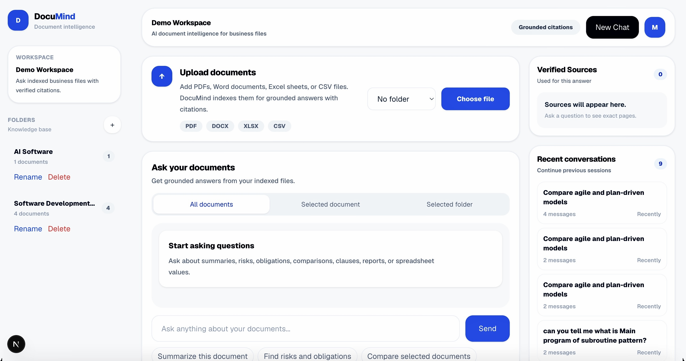
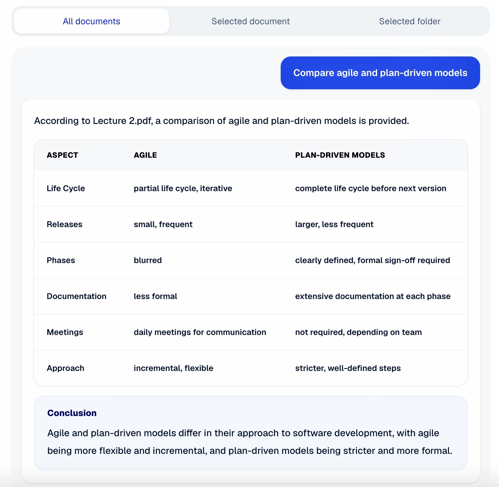
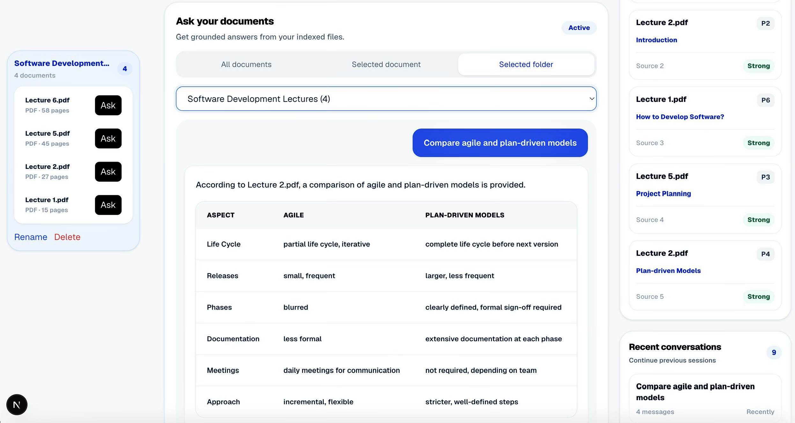

# DocuMind — AI Document Intelligence System


DocuMind is a full-stack AI document intelligence System that turns business files into a searchable knowledge base using Retrieval-Augmented Generation (RAG).

The system supports PDFs, Word documents, Excel sheets, and CSV files, then processes them through a complete AI pipeline: document parsing, chunking, embedding generation, hybrid retrieval, reranking, and grounded LLM answer generation with source citations.

Built as a business-focused AI product for document-heavy workflows such as reports, contracts, spreadsheets, internal files, and knowledge bases.

---

## Preview

### Home Page

A clean SaaS-style workspace for uploading documents, managing folders, asking questions, and reviewing verified sources.



### Chat with Verified Citations

DocuMind generates structured answers grounded in uploaded documents, including comparison tables and source-backed responses.



### Folder-Based Retrieval

Users can ask questions inside a selected folder and view the documents inside that folder directly from the sidebar.



---

## Why DocuMind?

Business teams often store important knowledge across scattered files. Searching manually is slow, repetitive, and error-prone, especially when users need reliable answers across multiple documents.

DocuMind turns uploaded files into a searchable knowledge base and lets users ask questions in natural language while keeping answers trustworthy through source citations.

From an engineering perspective, DocuMind focuses on the core challenges of real RAG applications: preparing messy documents for retrieval, selecting the most relevant context, reducing hallucination risk with citations, and making the system usable for non-technical business users.

---

## Key Features

- Multi-format document ingestion for PDF, DOCX, XLSX, XLSM, and CSV files
- Automated parsing and text extraction from uploaded business documents
- Chunking pipeline designed to make documents searchable and retrieval-friendly
- Embedding generation for semantic search over private document content
- Hybrid retrieval and reranking to improve answer relevance before LLM generation
- Grounded answer generation with verified source citations
- Question answering across all documents, a selected document, or a selected folder
- Folder-based document organization and document movement workflows
- Conversation history for continuing previous AI sessions
- Clean SaaS-style dashboard built for non-technical business users

---

## Architecture

DocuMind follows a production-oriented RAG architecture where documents are processed before being used for question answering.

```text
Document Upload
      ↓
File Parsing & Text Extraction
      ↓
Chunking
      ↓
Embedding Generation
      ↓
Vector / Database Storage
      ↓
User Question
      ↓
Hybrid Retrieval
      ↓
Reranking
      ↓
LLM Answer Generation
      ↓
Answer with Verified Citations
```

```text
Frontend: Next.js + TypeScript + Tailwind CSS
        |
        v
Backend: FastAPI
        |
        v
AI Pipeline:
Parsing → Chunking → Embeddings → Retrieval → Reranking → Generation
        |
        v
Grounded answer with document, page, and section references
```

---

## Tech Stack

**Frontend:** Next.js, TypeScript, React, Tailwind CSS  
**Backend:** Python, FastAPI, PostgreSQL / Supabase  
**AI / RAG:** Document Parsing, Chunking, Embeddings, Hybrid Search, Reranking, LLM Answer Generation, Source Citations  
**Product Layer:** Folder Workflows, Conversation History, Verified Sources, Document Library

---

## Project Structure

```text
DocuMind/
├── backend/
│   ├── app/
│   ├── requirements.txt
│   └── .env.example
│
├── frontend/
│   ├── app/
│   ├── components/
│   ├── lib/
│   ├── types/
│   ├── package.json
│   └── package-lock.json
│
├── docs/
│   └── screenshots/
│       ├── homepage.png
│       ├── chat-with-citations.png
│       └── folder-retrieval-mode.png
│
├── docker-compose.yml
├── README.md
└── .gitignore
```

---

## Running Locally

### Backend

```bash
cd backend
python -m venv venv
source venv/bin/activate
pip install -r requirements.txt
cp .env.example .env
uvicorn app.main:app --reload
```

Backend runs on:

```text
http://127.0.0.1:8000
```

FastAPI docs:

```text
http://127.0.0.1:8000/docs
```

### Frontend

Open another terminal:

```bash
cd frontend
npm install
npm run dev
```

Frontend runs on:

```text
http://localhost:3000
```

---

## Environment Variables

Create a local `.env` file from the example:

```bash
cp backend/.env.example backend/.env
```

Example:

```env
EMBEDDING_MODEL=sentence-transformers/all-MiniLM-L6-v2
DATABASE_URL=your_database_url_here
GROQ_API_KEY=your_groq_api_key_here
GROQ_MODEL=llama-3.3-70b-versatile
```

Never commit real API keys or database credentials.

Real values should stay only in:

```text
backend/.env
```

---

## Engineering Highlights

- Designed and implemented an end-to-end RAG pipeline from document upload to grounded answer generation
- Built document parsing and chunking workflows to prepare unstructured business files for retrieval
- Integrated embedding-based semantic search to retrieve relevant document chunks from private files
- Added hybrid retrieval and reranking to improve the quality of context passed to the LLM
- Implemented multiple retrieval scopes: all documents, selected document, and selected folder
- Added citation-aware responses to make LLM outputs more trustworthy and easier to verify
- Structured the backend with FastAPI services for parsing, chunking, embedding, retrieval, reranking, and generation
- Built a business-facing frontend that exposes complex AI workflows through a simple SaaS-style interface

---

## Future Improvements

- OCR support for scanned PDFs
- Streaming LLM responses
- Source highlighting inside document previews
- Authentication and team workspaces
- Dockerized deployment and CI/CD
- Export answers to PDF or DOCX

---

## Author

**Mohamed Abdel-Samie**  
CS & AI Student @ Assiut University  
Ex-AI Engineer Intern @ e& Egypt  

Focused on building production-oriented AI applications, LLM-powered tools, RAG workflows, and practical ML systems.

---

## License

This project is intended for portfolio and educational purposes.  
For commercial use, please contact the author.